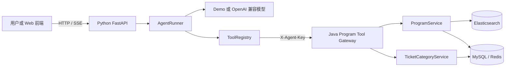

# Damai Agent 第一版

这是“Java 业务系统 + Python Agent”方案的首个可运行版本。Java 继续负责节目、票档、库存和交易事实；Python 负责对话、模型调用、工具选择、执行循环和会话上下文。



## 第一版能力

- `search_programs`：按关键词、区域、分类和时间搜索节目。
- `get_program_detail`：读取节目详情及购票规则。
- `list_ticket_categories`：读取票档、价格和查询时的剩余数量。
- 多轮 Agent 执行：模型可以连续选择工具，并根据工具结果组织回答。
- `sessionKey`：在同一进程中保留最近的对话和工具上下文。
- 普通 JSON 与 SSE 两种调用方式。
- Tool Gateway 独立密钥、每轮 `turnId`、每次 `toolCallId` 和链路 `traceId`。

第一版不包含下单、锁座、支付、退票，也不会尝试绕过排队、验证码或平台限制。

## 启动

先启动现有 Program Service（默认 `http://127.0.0.1:6086`），并保证 MySQL、Redis、Elasticsearch、Nacos 等原有依赖可用。Java 侧的 `AGENT_TOOL_API_KEY` 与 Python 侧的 `DAMAI_JAVA_TOOL_API_KEY` 必须取相同值。

在 Windows PowerShell 中启动 Python 服务：

```powershell
cd D:\QLDownload\code_402\damai\damai-agent-python
Copy-Item .env.example .env
py -3.9 -m venv .venv
.\.venv\Scripts\python.exe -m pip install -e .
.\.venv\Scripts\python.exe -m damai_agent.main
```

默认使用 `demo` provider，无需模型密钥，但仍会真实调用 Java 查询接口。接入支持 Chat Completions Tool Calling 的模型服务时，在 `.env` 中修改：

```dotenv
DAMAI_AGENT_PROVIDER=openai_compatible
DAMAI_LLM_BASE_URL=https://your-model-endpoint/v1
DAMAI_LLM_API_KEY=your-key
DAMAI_LLM_MODEL=your-model-name
```

## 调用示例

健康检查：

```powershell
Invoke-RestMethod http://127.0.0.1:9010/health
```

查询节目：

```powershell
$body = @{ message = "帮我查一下周杰伦的演唱会" } | ConvertTo-Json
Invoke-RestMethod -Method Post -Uri http://127.0.0.1:9010/api/v1/chat `
  -ContentType 'application/json' -Body $body
```

返回的 `sessionKey` 放到下一次请求中即可继续追问：

```json
{
  "message": "查询节目 123456 的票价和余票",
  "sessionKey": "session-上一轮返回值"
}
```

接口文档启动后位于 `http://127.0.0.1:9010/docs`。SSE 入口为 `POST /api/v1/chat/stream`。这里使用 9010，避免与当前 nanobot WebUI 的 9009 端口冲突。

## 验证核心循环

核心测试不依赖数据库和外部模型：

```powershell
py -3.9 -m unittest discover -s tests -v
```

内存会话仅适用于第一版单实例。后续多实例部署时应把 Session/Checkpoint 替换为 Redis 或数据库实现；Runner 和 ToolRegistry 不需要因此改写。
