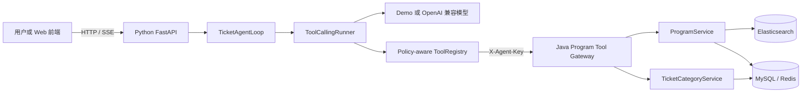

# Damai Agent 第一版

这是“Java 业务系统 + Python Agent”方案的首个可运行版本。Java 继续负责节目、票档、库存和交易事实；Python 负责对话、模型调用、工具选择、执行循环和会话上下文。



## 第一版能力

- `search_programs`：按关键词、区域、分类和时间搜索节目。
- `get_program_detail`：读取节目详情及购票规则。
- `list_ticket_categories`：读取票档、价格和查询时的剩余数量。
- 多轮 Agent 执行：模型可以连续选择工具，并根据工具结果组织回答。
- `sessionKey`：在同一进程中保留最近的对话和工具上下文。
- 普通 JSON 与 SSE 两种调用方式。
- Tool Gateway 独立密钥、每轮 `turnId`、每次 `toolCallId` 和 W3C `traceparent`。
- 受信 `TicketTurnContext`、版本化 `AgentRunSpec/Result` 与连续编号的 Agent Event。
- Tool 参数 JSON Schema 校验、Scope/风险策略和单轮调用预算。
- Provider 结束原因、模型路由和 Token Usage 汇总。
- OpenAPI 自动生成 Pydantic 请求/响应模型，Java Tool Result 缺字段或串单时默认拒绝。
- Provider 文本与 Tool Call 分片流、Usage/结束事件，以及 SSE 空闲超时保护。
- 相邻且授权的只读 Tool 可限量并发；独占和非只读 Tool 是串行屏障，结果与事件保持原顺序。
- 每轮独立的 Policy、Trace、Audit、Usage Hook 链；默认审计只写元数据日志，不包含 Tool 参数或返回内容。
- 模型请求字符预算、单个 Tool Result 限长；裁剪旧对话时保留完整工具调用—结果配对，无法容纳当前轮时返回稳定错误。

第一版不包含下单、锁座、支付、退票，也不会尝试绕过排队、验证码或平台限制。

## 启动

先启动现有 Program Service（默认 `http://127.0.0.1:6086`），并保证 MySQL、Redis、Elasticsearch、Nacos 等原有依赖可用。Java 侧的 `AGENT_TOOL_API_KEY` 与 Python 侧的 `DAMAI_JAVA_TOOL_API_KEY` 必须取相同值。

在 Windows PowerShell 中启动 Python 服务：

```powershell
cd D:\QLDownload\code_402\damai\damai-agent-python
Copy-Item .env.example .env
uv sync --frozen --extra dev --python 3.11
uv run --frozen python -m damai_agent.main
```

默认使用 `demo` provider，无需模型密钥，但仍会真实调用 Java 查询接口。接入支持 Chat Completions Tool Calling 的模型服务时，在 `.env` 中修改：

```dotenv
DAMAI_AGENT_PROVIDER=openai_compatible
DAMAI_LLM_BASE_URL=https://your-model-endpoint/v1
DAMAI_LLM_API_KEY=your-key
DAMAI_LLM_MODEL=your-model-name
```

## 调用示例

健康检查：

```powershell
Invoke-RestMethod http://127.0.0.1:9010/health
```

查询节目：

```powershell
$body = @{ message = "帮我查一下周杰伦的演唱会" } | ConvertTo-Json
Invoke-RestMethod -Method Post -Uri http://127.0.0.1:9010/api/v1/chat `
  -ContentType 'application/json' -Body $body
```

返回的 `sessionKey` 放到下一次请求中即可继续追问：

```json
{
  "message": "查询节目 123456 的票价和余票",
  "sessionKey": "session-上一轮返回值"
}
```

接口文档启动后位于 `http://127.0.0.1:9010/docs`。SSE 入口为 `POST /api/v1/chat/stream`。这里使用 9010，避免与当前 nanobot WebUI 的 9009 端口冲突。

`DAMAI_AGENT_MAX_CONCURRENT_READ_TOOLS` 默认为 4（可设 1～12）；仅影响同一轮模型请求中相邻且声明为 `READ_ONLY`、`concurrency_safe` 且非独占的 Tool Call。设置为 1 可关闭并行执行。当前 Java 客户端仍使用同步网络线程，超时后底层请求可能继续运行，生产级独占保证仍需在 Java 侧配合幂等与取消控制。

`DAMAI_AGENT_MAX_CONTEXT_CHARS` 默认 80000，限制发给模型的消息与 Tool Schema 序列化字符数；超限时先移除最旧的完整对话轮次，当前轮仍超限则安全停止。`DAMAI_AGENT_MAX_TOOL_RESULT_CHARS` 默认 16000，单个 Tool Result 超限时交给模型的是明确的 `TOOL_RESULT_TOO_LARGE` 错误，不截断业务字段。这是保守的字符数保护，不等同于特定模型的 Token 上限；生产部署仍需按模型上下文窗口预留输出 Token 并建立 Token 级预算。

## 验证核心循环

核心测试不依赖数据库和外部模型：

```powershell
uv run --frozen pytest --cov=damai_agent
```

内存会话仅适用于第一版单实例。后续多实例部署时应把 Session/Checkpoint 替换为 Redis 或数据库实现；Runner 和 ToolRegistry 不需要因此改写。

## 企业级演进

- [企业级开发设计与实施计划](docs/enterprise-agent-development.md)
- [阶段 0 检查清单](docs/phase-0-checklist.md)
- [阶段 0 真实链路一键验收](docs/phase-0-live-acceptance.md)
- [阶段 1 检查清单](docs/phase-1-checklist.md)
- [阶段 2 检查清单](docs/phase-2-checklist.md)
- [阶段 2 持久化入口操作说明](docs/phase-2-operations.md)
- [阶段 3 检查清单](docs/phase-3-checklist.md)
- [阶段 4 检查清单](docs/phase-4-checklist.md)
- [阶段 5 检查清单](docs/phase-5-checklist.md)
- [Architecture Decision Records](docs/adr/README.md)

阶段 0 将 Python 运行基线提升到 3.11，并建立配置 Profile、生产启动保护、OpenAPI 单一来源、Tool Schema 生成与 CI 质量门禁。

阶段 1 已完成运行契约、Tool 输入/输出边界、Provider 真实流式、受控只读 Tool 并发、基础 Hook 链和字符级上下文治理。审计当前仅为进程日志或由部署方提供的 Sink，尚无持久化、不可篡改和跨服务关联保证；模型 Token 级预算与真实链路故障验收仍在后续批次。

阶段 2 新增 PostgreSQL Session/Turn/Message/Checkpoint/Event 存储、Redis 租约/取消/有界排队，以及签名委托保护的 `/api/v2/turns` 和可用 `Last-Event-ID` 续传的 SSE。迁移脚本 `001`、`002`、`003` 须按序执行；分别通过 `postgres`、`redis` 可选依赖安装。设置 `DAMAI_AGENT_RUNTIME_BACKEND=durable` 后，旧匿名 `/api/v1/chat` 禁用；默认本地配置仍用内存模式。阶段 5 起持久化入口可在显式开关、Scope 和审计保护下接受可撤销监控写操作，仍拒绝订单写入。中断恢复会保留已确认结果、把未知结果明确标记为未知并终结 Turn，不会盲目重放工具。外部请求的副作用不受数据库 fencing 保护，生产准入仍以真实 Java 链路、进程中断和多副本故障验收为前提。生产须配置独立账号、TLS、加密、保留期、备份与连接容量。详见[阶段 2 检查清单](docs/phase-2-checklist.md)和[操作说明](docs/phase-2-operations.md)。

阶段 3 首批加入可选的模型暂时性故障重试与备用路由，默认关闭。流式输出一旦开始就不会重试或切换，以免客户端收到拼接的两次模型回复；详见[阶段 3 检查清单](docs/phase-3-checklist.md)。

阶段 3 第二批增加可选的单 Turn Token/估算费用安全点预算，以及经内部密钥保护的 `GET /metrics` 实例级指标。费用以整数微美元返回，按版本化定价与模型上报 Usage 估算；供应商账单对账仍待测试环境核验。

阶段 3 第三批增加可选的 Redis 租户日额度、OTLP Trace 与 PostgreSQL Tool 元数据审计。先执行 `004_agent_tool_audit.sql`，并在需要 Trace 导出时安装 `observability` extra；详见[阶段 3 清单](docs/phase-3-checklist.md)。真实 Java 链路故障和 SLO 灰度验收仍待测试专用环境，不应直接在业务云环境注入故障。

只读链路的告警查询、故障处置和未完成的真实验收证据见[阶段 3 SLO 手册](docs/phase-3-slo-runbook.md)。

阶段 4 第一批加入租户隔离的稳定知识检索、动态事实隔离、来源白名单和强制引用门禁。无有效引用的 RAG 回答不会返回；流式内容在引用校验前会被缓冲。启用方式、知识目录结构及离线 Eval 见[阶段 4 检查清单](docs/phase-4-checklist.md)。

阶段 4 第二批加入云 Elasticsearch 只读检索、索引别名与版本约束、双重租户/时效/来源校验，以及推荐预算硬上限。Python 会从用户明确表达中注入或收紧 `maxPrice`，Java Tool Gateway 会再次过滤城市、分类、自定义日期和最低票价。

阶段 4 第三批新增 `recommend_programs` 复合只读 Tool：Java 对有界候选批量核验实时票档，只返回有预算内余票的节目并给出确定性排名原因；Python 会把明确推荐意图强制路由到该 Tool。知识索引发布支持审核后校验、不可变索引、原子别名切换、精确回滚和活动索引删除保护，操作见[知识索引发布与回滚](docs/phase-4-knowledge-operations.md)。

阶段 4 第四批新增中文多路词法检索与 RRF 融合、可审计的确定性重排，以及按 `sessionKey` 稳定分桶的灰度开关。`knowledge.retrieved` 事件、Trace 和 Prometheus 指标会记录实验组及检索延迟。RAG 发布门禁现可检查 Recall、MRR、引用精度/完整性、租户泄漏红线和 P95；推荐门禁检查实时 Tool 路由、预算、偏好和实时核验。配置与命令见[阶段 4 检查清单](docs/phase-4-checklist.md)。

阶段 4 第五批采用高级 RAG 检索树：Elasticsearch `semantic_text` 自动分块和向量化，BM25 与语义召回在服务端经 RRF 合并，并可选用 Cross-Encoder 进行二阶段重排。语义高亮片段进入有界上下文，引用仍绑定审核过的父文档；旧索引继续使用 `lexical` Profile。架构约束见 [ADR-011](docs/adr/011-advanced-rag-retrieval.md)。

阶段 4 第六批把语义索引发布升级为 `stage -> acceptance -> promote`：显式中文分块策略、真实 Embedding 探测、隐藏向量块验证、分批 Bulk，以及针对具体索引的 Recall/MRR/P95/QPS/真实费用报告均为晋级硬门禁。缺少云账单证据时不会切换线上别名，详见[知识索引发布与回滚](docs/phase-4-knowledge-operations.md)。

阶段 5 第一批建立票务监控安全控制面：规则由 Java 持久化，Python 仅通过 `REVERSIBLE_WRITE` Tool 管理；受信租户/用户身份不进入模型参数，原始 HMAC 委托会在 Java 再验证，创建具备幂等键，修改使用乐观版本。Java 与 Python 双侧默认关闭，启用前必须执行 MySQL 迁移、打开持久化 Tool 审计，并由 Java BFF 签发 `watch:*` Scope。当前尚未交付调度 Worker 和通知 Outbox，因此不会把“规则已创建”描述为“通知闭环已完成”。详见[阶段 5 检查清单](docs/phase-5-checklist.md)和 [ADR-012](docs/adr/012-watch-rule-ownership.md)。
