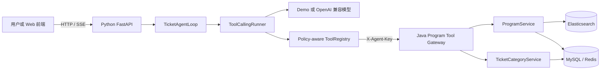

# Damai Agent 第一版

这是“Java 业务系统 + Python Agent”方案的首个可运行版本。Java 继续负责节目、票档、库存和交易事实；Python 负责对话、模型调用、工具选择、执行循环和会话上下文。



## 第一版能力

- `search_programs`：按关键词、区域、分类和时间搜索节目。
- `get_program_detail`：读取节目详情及购票规则。
- `list_ticket_categories`：读取票档、价格和查询时的剩余数量。
- 多轮 Agent 执行：模型可以连续选择工具，并根据工具结果组织回答。
- `sessionKey`：在同一进程中保留最近的对话和工具上下文。
- 普通 JSON 与 SSE 两种调用方式。
- Tool Gateway 独立密钥、每轮 `turnId`、每次 `toolCallId` 和 W3C `traceparent`。
- 受信 `TicketTurnContext`、版本化 `AgentRunSpec/Result` 与连续编号的 Agent Event。
- Tool 参数 JSON Schema 校验、Scope/风险策略和单轮调用预算。
- Provider 结束原因、模型路由和 Token Usage 汇总。
- OpenAPI 自动生成 Pydantic 请求/响应模型，Java Tool Result 缺字段或串单时默认拒绝。
- Provider 文本与 Tool Call 分片流、Usage/结束事件，以及 SSE 空闲超时保护。
- 相邻且授权的只读 Tool 可限量并发；独占和非只读 Tool 是串行屏障，结果与事件保持原顺序。
- 每轮独立的 Policy、Trace、Audit、Usage Hook 链；默认审计只写元数据日志，不包含 Tool 参数或返回内容。
- 模型请求字符预算、单个 Tool Result 限长；裁剪旧对话时保留完整工具调用—结果配对，无法容纳当前轮时返回稳定错误。

第一版不包含下单、锁座、支付、退票，也不会尝试绕过排队、验证码或平台限制。

## 启动

先启动现有 Program Service（默认 `http://127.0.0.1:6086`），并保证 MySQL、Redis、Elasticsearch、Nacos 等原有依赖可用。Java 侧的 `AGENT_TOOL_API_KEY` 与 Python 侧的 `DAMAI_JAVA_TOOL_API_KEY` 必须取相同值。

在 Windows PowerShell 中启动 Python 服务：

```powershell
cd D:\QLDownload\code_402\damai\damai-agent-python
Copy-Item .env.example .env
uv sync --frozen --extra dev --python 3.11
uv run --frozen python -m damai_agent.main
```

默认使用 `demo` provider，无需模型密钥，但仍会真实调用 Java 查询接口。接入支持 Chat Completions Tool Calling 的模型服务时，在 `.env` 中修改：

```dotenv
DAMAI_AGENT_PROVIDER=openai_compatible
DAMAI_LLM_BASE_URL=https://your-model-endpoint/v1
DAMAI_LLM_API_KEY=your-key
DAMAI_LLM_MODEL=your-model-name
```

## 调用示例

健康检查：

```powershell
Invoke-RestMethod http://127.0.0.1:9010/health
```

查询节目：

```powershell
$body = @{ message = "帮我查一下周杰伦的演唱会" } | ConvertTo-Json
Invoke-RestMethod -Method Post -Uri http://127.0.0.1:9010/api/v1/chat `
  -ContentType 'application/json' -Body $body
```

返回的 `sessionKey` 放到下一次请求中即可继续追问：

```json
{
  "message": "查询节目 123456 的票价和余票",
  "sessionKey": "session-上一轮返回值"
}
```

接口文档启动后位于 `http://127.0.0.1:9010/docs`。SSE 入口为 `POST /api/v1/chat/stream`。这里使用 9010，避免与当前 nanobot WebUI 的 9009 端口冲突。

`DAMAI_AGENT_MAX_CONCURRENT_READ_TOOLS` 默认为 4（可设 1～12）；仅影响同一轮模型请求中相邻且声明为 `READ_ONLY`、`concurrency_safe` 且非独占的 Tool Call。设置为 1 可关闭并行执行。当前 Java 客户端仍使用同步网络线程，超时后底层请求可能继续运行，生产级独占保证仍需在 Java 侧配合幂等与取消控制。

`DAMAI_AGENT_MAX_CONTEXT_CHARS` 默认 80000，限制发给模型的消息与 Tool Schema 序列化字符数；超限时先移除最旧的完整对话轮次，当前轮仍超限则安全停止。`DAMAI_AGENT_MAX_TOOL_RESULT_CHARS` 默认 16000，单个 Tool Result 超限时交给模型的是明确的 `TOOL_RESULT_TOO_LARGE` 错误，不截断业务字段。这是保守的字符数保护，不等同于特定模型的 Token 上限；生产部署仍需按模型上下文窗口预留输出 Token 并建立 Token 级预算。

## 验证核心循环

核心测试不依赖数据库和外部模型：

```powershell
uv run --frozen pytest --cov=damai_agent
```

内存会话仅适用于第一版单实例。后续多实例部署时应把 Session/Checkpoint 替换为 Redis 或数据库实现；Runner 和 ToolRegistry 不需要因此改写。

## 企业级演进

- [企业级开发设计与实施计划](docs/enterprise-agent-development.md)
- [阶段 0 检查清单](docs/phase-0-checklist.md)
- [阶段 0 真实链路一键验收](docs/phase-0-live-acceptance.md)
- [阶段 1 检查清单](docs/phase-1-checklist.md)
- [阶段 2 检查清单](docs/phase-2-checklist.md)
- [Architecture Decision Records](docs/adr/README.md)

阶段 0 将 Python 运行基线提升到 3.11，并建立配置 Profile、生产启动保护、OpenAPI 单一来源、Tool Schema 生成与 CI 质量门禁。

阶段 1 已完成运行契约、Tool 输入/输出边界、Provider 真实流式、受控只读 Tool 并发、基础 Hook 链和字符级上下文治理。审计当前仅为进程日志或由部署方提供的 Sink，尚无持久化、不可篡改和跨服务关联保证；模型 Token 级预算与真实链路故障验收仍在后续批次。

阶段 2 已建立 Checkpoint 安全契约，并提供可选的 PostgreSQL Checkpoint/Session/Turn/Message Repository 与 Redis Session 租约原语。迁移脚本位于 `migrations/001_agent_active_checkpoint.sql` 和 `migrations/002_agent_session_turn.sql`，需按顺序由有权限的迁移账号执行；分别通过 `postgres`、`redis` 可选依赖安装。现有 Agent 运行时仍使用进程内会话，尚未接入 PostgreSQL/Redis 自动恢复；Turn 完成提交和通过 `PostgresTurnRepository` 进行的 Checkpoint 写入有数据库 fencing，一批 Tool 的消息与 Checkpoint 清理也可原子提交。旧的独立 Checkpoint Repository 与外部 Tool 副作用不受该代次保护，不能据此认定已有崩溃恢复或多副本严格串行能力。Checkpoint 和历史消息可能包含用户输入及 Tool 参数/结果，生产使用前须完成数据库账号隔离、传输与静态加密、保留期和备份设计。详见[阶段 2 检查清单](docs/phase-2-checklist.md)。
