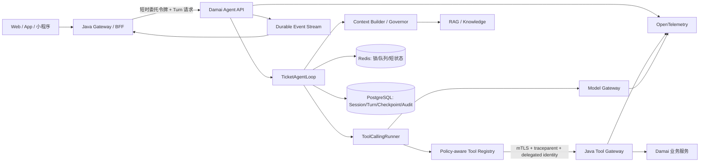
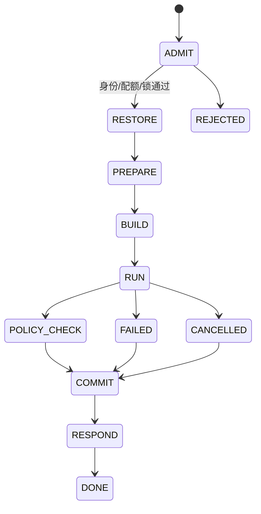

# Damai Agent 企业级开发设计与实施计划

> 文档版本：1.2<br>
> 基线日期：2026-09-06<br>
> 最近更新：2026-09-16<br>
> 目标项目：`damai-agent-python` 0.1.0<br>
> 参考实现：本机 `nanobot-ai` 0.3.0 源码<br>
> 文档状态：开发基线，后续架构变更必须通过 ADR 更新

## 1. 结论

`damai-agent-python` 已完成阶段 0 工程基线，并进入阶段 1：FastAPI 接入、三项 Java 只读工具、进程内会话、JSON/SSE、W3C Trace、运行契约、Loop/Runner 分层、Tool 输入/输出校验和 Provider 真实流式已落地。现有 38 项 Python 测试与 6 项 Java 契约/Trace 测试全部通过，可以作为后续演进的可运行基线。

下一阶段不应直接复制 `nanobot`，也不应急于增加下单、支付或大量通用工具。建议吸收 `nanobot` 已验证的运行时分层思想，构建“领域受限、默认拒绝、可恢复、可观测”的购票 Agent：

1. Java 继续作为业务事实、权限、订单状态机和幂等执行的唯一权威来源。
2. Python 只负责模型编排、上下文治理、工具调用、流式事件、会话记忆和 Agent 评测。
3. 先把只读链路做到可生产，再增加监控和购买意向；订单提交必须经过 Java 生成的受信确认授权。
4. 动态库存、价格、开售状态和订单状态只能来自实时 Java Tool，不能来自模型记忆或 RAG。
5. 企业级的完成标准由安全、可靠性、可恢复性、可观测性和质量门禁决定，而不是工具数量。

## 2. 当前基线

### 2.1 已有能力

| 能力 | 当前实现 | 评价 |
|---|---|---|
| HTTP 服务 | `damai_agent/api.py` 提供健康检查、JSON Chat、SSE 和生产内部密钥鉴权 | 可运行，但没有最终用户委托身份、限流和生命周期治理 |
| Agent 循环 | `TicketAgentLoop` 编排生命周期，`ToolCallingRunner` 执行模型/工具循环 | 职责已拆分，尚无 Checkpoint、取消和上下文预算 |
| Provider | Demo 与 OpenAI-compatible Chat Completions，支持文本/Tool 分片、结束原因、路由和 Usage | 真实流式已落地，仍缺少重试、降级和费用治理 |
| Tool | 3 个 Java 只读工具、请求/响应模型校验、Scope/风险/次数策略、受控只读并发与独占屏障 | 输入输出边界默认拒绝；同步 Java 客户端的物理取消和跨进程独占仍待落地 |
| Session | `InMemorySessionStore`，同 Session 串行 | 适合单实例测试，不可跨进程恢复，锁和历史没有 TTL |
| 契约 | `contracts/agent-tools-v1.openapi.yaml` 生成 Python ToolSpec、请求/响应 Pydantic 模型与执行元数据 | Python 契约已单一来源，并由 CI 检查漂移与兼容性 |
| Java 网关 | API Key、统一响应、必填 Tool/Turn/Session Header、W3C `traceparent` | 具备内部调用基线，仍缺少租户和用户委托身份 |
| 测试 | Python 单元/集成/契约测试与 Java 契约/Trace 测试 | Python 45 项、Java 6 项通过；Python 分支覆盖率 85.69%，仍需增加故障测试 |

### 2.2 主要缺口

P0 阻断项：

- 对外 Chat API 没有身份认证、租户隔离、请求级 Tool Scope、限流和请求体审计。
- Session、Turn 和运行中 Tool Call 都只存在于内存，进程退出后无法恢复。
- Provider 已采集结束原因、路由与 Token Usage，但没有分类重试、`Retry-After`、空响应恢复、fallback 和熔断。
- Java 内部接口默认密钥为 `change-me-local`，没有启动时拒绝弱密钥，也没有 mTLS 或短时委托令牌。
- Java DTO 仍为手写实现；共享契约样例已进入双端测试，但后续仍可评估由 OpenAPI 生成 Java 契约类型。
- 没有 Metrics、OpenTelemetry Span、费用记录和不可抵赖审计。

P1 能力缺口：

- 没有 AgentLoop 外层状态机、Pending Injection、取消、Checkpoint、Hook 和 Context Governor。
- 没有 Redis/PostgreSQL 会话持久化、分布式 Session 锁和幂等 Turn。
- 没有 RAG、来源引用、长期偏好、历史压缩和离线 Agent Eval。
- 没有监控任务、通知去重、购买意向、一次性确认授权和订单恢复协议。

### 2.3 当前实现中应尽快修正的细节

- `freshnessAt` 当前由 Java 响应封装器按响应时间生成，并不一定代表库存数据源真实采集时间。企业版必须由业务数据提供者返回实际采集时间。
- 票价在 OpenAPI 中使用通用 `number`。交易相关金额应统一为最小货币单位整数，例如 `amountFen: 188000`，或使用明确精度的十进制字符串。
- HTTP Header 已迁移到 W3C `traceparent`；下一步接入 OpenTelemetry Span 导出，并继续将业务 ID 作为 Span Attribute。
- SSE 错误事件不能直接返回内部异常文本；外部返回稳定错误码，详细堆栈只进入受控日志。
- 全局 `app = create_app()` 与启动器二次读取配置不利于测试和优雅关闭，应改为单一 Bootstrap + FastAPI Lifespan。

## 3. 对 nanobot 的取舍

本次参考的是本机 `nanobot-ai 0.3.0` 源码。它目前标记为 Alpha，适合作为机制参考，不应成为 Damai 交易链路的直接运行依赖。

### 3.1 建议吸收

| nanobot 机制 | Damai 对应实现 | 价值 |
|---|---|---|
| `AgentLoop` 外层状态机 | `TicketAgentLoop` | 把恢复、构建、运行、保存和响应从 Runner 中分离 |
| `AgentRunSpec/Result` | 稳定的运行输入/输出契约 | 便于测试、SDK、重放和 Hook 扩展 |
| Tool 参数校验与类型转换 | `TicketToolRegistry.prepare_call` | 模型参数不能直接进入 Java Tool Gateway |
| `read_only/concurrency_safe/exclusive` | Tool 风险与调度元数据 | 只读可并发，写操作严格串行 |
| Runner Checkpoint | `AgentCheckpoint` | 中断后补齐 Tool 协议并安全恢复 |
| Pending Injection | `TurnInbox` | 当前轮接收用户补充、取消和业务状态变化 |
| Context Governor | `TicketContextGovernor` | 控制 Token、修复 Tool Call/Result 配对并压缩大结果 |
| Composite Hook | Trace、Audit、Policy、Usage Hook | 扩展点与核心执行逻辑解耦 |
| Provider retry/fallback | `ModelGateway` | 识别暂时性错误、遵守 Retry-After、跨模型降级 |
| Session 原子保存和损坏恢复 | PostgreSQL/Redis 持久化实现 | 保证 Turn 可追溯和可恢复 |
| SSRF 与工作区边界 | 出站 URL 策略与资源作用域 | 为未来 RAG、MCP 或外部连接器提供默认拒绝保护 |

### 3.2 不建议照搬

- Shell、任意文件系统、通用 Web 抓取等高权限个人助手工具。
- 文件 JSONL 作为企业多实例的主会话数据库。
- 默认开放 MCP、Skills、Subagent 或多渠道插件体系。
- 让模型直接持有订单确认令牌、Cookie、身份证件或支付凭据。
- 让 Python 常驻轮询库存；监控调度应由 Java 的可靠任务系统执行。
- 让通用 Agent Memory 成为库存、价格、订单等动态事实来源。

## 4. 目标范围与系统边界

### 4.1 企业版定义

本文中的“企业级”至少意味着：

- 支持多实例部署、滚动升级、优雅关闭和故障恢复；
- 用户、租户、Session、Turn、Tool Scope 全链路隔离；
- 每个 Tool Call 可验证、可授权、可审计、可追踪、可限流；
- 相同业务请求可幂等重放，高风险操作不能因重试产生重复订单；
- Provider、Redis、PostgreSQL、Java Tool Gateway 部分故障时有明确降级；
- Prompt、模型、工具和知识库变更有离线评测与发布门禁；
- 生产日志不泄露密钥、证件、完整 Prompt 或支付敏感数据。

### 4.2 强制职责边界

| Python Agent 平面 | Java 业务平面 |
|---|---|
| 意图理解、上下文构建、模型调用 | 用户、租户、购票人和权限 |
| Tool 规划与结果解释 | 演出、场次、票档、库存和价格事实 |
| Session 对话、Checkpoint、Token 预算 | 监控规则、购买意向、订单和支付状态机 |
| RAG、引用、偏好抽取和评测 | 幂等、事务、分布式锁、风控和审计事实 |
| 流式 Agent 事件 | 官方/授权票务连接器 |

Python 禁止直连订单、库存和支付数据库，也禁止重新实现 Java 领域规则。

## 5. 目标架构



公网入口建议收敛到 Java Gateway/BFF。Python API 默认只监听内网，用 Java 验证后的短时委托令牌承载 `tenantId/userId/sessionId/turnId/toolScopes/exp`。过渡期可保留当前直连 API，但只能用于本地开发和受控测试环境。

## 6. Python 目标模块

```text
damai_agent/
├── bootstrap.py                 # 配置、依赖装配、Lifespan、优雅关闭
├── api/
│   ├── app.py                   # FastAPI app factory
│   ├── dependencies.py          # 认证、租户、限流、request context
│   ├── routes_turns.py          # Turn 创建、取消、查询
│   ├── routes_events.py         # SSE/WebSocket 事件恢复
│   └── errors.py                # 稳定外部错误协议
├── runtime/
│   ├── loop.py                  # TicketAgentLoop 状态机
│   ├── runner.py                # 纯模型—工具执行循环
│   ├── run_spec.py              # AgentRunSpec / AgentRunResult
│   ├── turn_context.py          # 受信上下文
│   ├── checkpoint.py            # 运行现场与恢复
│   ├── pending_queue.py         # 用户补充/取消/内部事件注入
│   └── cancellation.py
├── context/
│   ├── builder.py
│   ├── governor.py
│   ├── compactor.py
│   └── prompt_catalog.py        # 版本化 Prompt，不散落硬编码
├── providers/
│   ├── base.py
│   ├── gateway.py               # 路由、fallback、熔断、用量
│   ├── openai_compatible.py
│   └── demo.py
├── tools/
│   ├── base.py                  # Tool 元数据、风险等级、Schema
│   ├── registry.py              # 解析、转换、校验、授权
│   ├── executor.py              # 并发、超时、重试、隔离
│   ├── java_client.py           # HTTP 连接池、Trace、委托身份
│   ├── generated/               # 由 contracts 生成的模型/Schema
│   └── catalog.py               # 领域 Tool 装配
├── sessions/
│   ├── interfaces.py
│   ├── postgres.py
│   ├── redis_lock.py
│   └── repositories.py
├── policy/
│   ├── engine.py
│   ├── tool_risk.py
│   ├── prompt_injection.py
│   ├── pii.py
│   └── output_guard.py
├── knowledge/
│   ├── retrieval.py
│   ├── rerank.py
│   └── citations.py
├── observability/
│   ├── hooks.py
│   ├── logging.py
│   ├── metrics.py
│   └── tracing.py
└── domain/
    ├── messages.py
    ├── events.py
    └── errors.py
```

拆分原则：Runner 不知道 FastAPI、数据库、渠道和购票业务；Loop 负责编排生命周期；Tool 只做参数校验、受信上下文传递、Java 调用和结果归一化。

## 7. Turn 生命周期



| 状态 | 责任 |
|---|---|
| `ADMIT` | 验证委托令牌、租户、配额、Tool Scope，获取 Session 分布式锁 |
| `RESTORE` | 加载 Session、未完成 Turn 与 Checkpoint；补齐未完成 Tool Result |
| `PREPARE` | 压缩历史、处理取消/命令、冻结 Prompt/模型/Tool 版本 |
| `BUILD` | 构建受信 System Context、历史、用户输入、RAG 引用和可用 Tool |
| `RUN` | 执行有预算限制的模型—工具循环，并持续写 Checkpoint |
| `POLICY_CHECK` | 检查最终输出、高风险动作、动态事实来源和敏感信息 |
| `COMMIT` | 原子保存消息、Turn、Usage、Tool Audit，清理 Checkpoint |
| `RESPOND` | 发出完成/失败/取消事件，释放锁和资源 |

建议的受信 `TicketTurnContext`：

```python
@dataclass(frozen=True, slots=True)
class TicketTurnContext:
    tenant_id: str
    user_id: str
    session_key: str
    turn_id: str
    request_id: str
    trace_id: str
    locale: str
    channel: str
    tool_scopes: frozenset[str]
    risk_ceiling: str
    delegation_token_id: str
```

这些字段只能由认证层构造，模型输出和用户消息不能覆盖。

## 8. Runner 设计

`ToolCallingRunner` 接收 `AgentRunSpec`，返回 `AgentRunResult`。输入应冻结以下版本：模型、生成参数、System Prompt、Tool Schema、策略和知识索引版本，使一次 Turn 可以重放和审计。

每轮算法：

1. Context Governor 清理协议、控制 Token 和 Tool Result 大小。
2. 调用 Provider，设置模型请求总超时和流空闲超时。
3. 校验 `finish_reason`，拒绝在 refusal/content-filter/error 状态下夹带的 Tool Call。
4. 对 Tool Name、参数 Schema、Scope、风险、调用次数和重复目标进行校验。
5. 保存 `awaiting_tools` Checkpoint。
6. 并发执行安全只读 Tool；写 Tool 或独占 Tool 串行执行。
7. 每完成一个 Tool 立即保存 `tool_progress` Checkpoint，并发送事件。
8. 注入当前轮新消息/取消信号，再决定下一次模型调用。
9. 达到迭代或 Token 预算后，使用无 Tool 的受控总结请求结束，禁止无限循环。

`AgentRunResult` 至少包含：

```text
final_content
messages
tools_used
usage(prompt/completion/cached/reasoning tokens)
cost
stop_reason
error_code
tool_events
model_route
had_injections
```

## 9. Tool 平台

### 9.1 Tool 描述

```python
class ToolRisk(str, Enum):
    READ_ONLY = "READ_ONLY"
    REVERSIBLE_WRITE = "REVERSIBLE_WRITE"
    ORDER_WRITE = "ORDER_WRITE"
    PROHIBITED = "PROHIBITED"

@dataclass(frozen=True, slots=True)
class ToolDescriptor:
    name: str
    version: str
    description: str
    parameters_schema: dict
    result_schema_ref: str
    risk: ToolRisk
    required_scope: str
    concurrency_safe: bool
    exclusive: bool
    timeout_ms: int
    max_calls_per_turn: int
```

### 9.2 执行规则

| 等级 | 示例 | 模型权限 | 执行约束 |
|---|---|---|---|
| `READ_ONLY` | 搜索、详情、票档、订单状态 | 可自动调用 | 可按安全标记并发；结果带真实 `freshnessAt` |
| `REVERSIBLE_WRITE` | 创建/暂停监控、保存偏好 | 按请求 Scope 开放 | 登录、幂等、审计、速率限制 |
| `ORDER_WRITE` | 提交已确认订单、取消待支付订单 | 默认不进入 Tool 列表 | Java 受信 Confirmation Grant、幂等键、串行执行 |
| `PROHIBITED` | 支付凭证、验证码、绕过排队、直接改库存 | 永不开放 | 代码和策略双重禁止 |

Python 执行顺序必须是：

```text
解析参数
→ 安全类型转换
→ JSON Schema 校验
→ Tool Scope / 风险策略
→ 调用次数与目标限流
→ Checkpoint
→ Java Tool Gateway
→ Result Schema 校验
→ 脱敏/截断
→ 模型观察
```

Tool Schema 应由根目录 `contracts` 生成 Python 模型和 Java DTO，禁止长期双写。CI 必须执行兼容性检查与契约样例测试。

### 9.3 Java Client

从 `urllib` 迁移到具有连接池的异步 HTTP Client，并具备：

- connect/read/write/pool 分项超时；
- W3C Trace Context；
- mTLS、短时委托令牌和密钥轮换；
- 仅重试明确幂等且 `retryable=true` 的请求；
- 限定目的服务，不允许模型控制 Host、完整 URL 或 Header；
- 连接池指标、熔断、隔离舱和响应大小上限。

## 10. Session、Checkpoint 与并发

### 10.1 数据归属

- PostgreSQL：Session、Message、Turn、Checkpoint、Tool Audit、Usage 和最终事件。
- Redis：Session 分布式锁、短期 Pending Queue、取消标记、SSE 扇出和限流计数。
- Java 数据库：购买意向、Confirmation Grant、订单、支付和所有业务事实。

### 10.2 并发约束

- 同一 `tenantId + sessionKey` 严格串行；不同 Session 可并行。
- 锁必须有 owner token、租约和续租，释放时校验 owner。
- Turn 创建使用客户端 `idempotencyKey`；重复请求返回同一 Turn。
- 并发上限至少包含：进程总量、租户、用户、Session、Provider 和 Tool 目的服务。

### 10.3 Checkpoint

```json
{
  "phase": "tool_progress",
  "turnId": "turn_...",
  "iteration": 2,
  "modelRoute": "primary/model-a",
  "assistantMessage": {},
  "completedToolResults": [],
  "pendingToolCalls": [],
  "promptVersion": "ticket-assistant@3",
  "toolsetVersion": "agent-tools-v1@sha256:...",
  "updatedAt": "2026-09-06T03:00:00Z"
}
```

恢复时，未完成 Tool Call 不能被假定成功。只读 Tool 可按策略重新执行；写 Tool 必须先凭幂等键向 Java 查询执行事实。无法确认时补一个结构化失败 Tool Result，使消息协议保持合法。

## 11. Provider 与模型网关

Provider 抽象必须同时支持完整响应与增量事件：文本 delta、Tool Call delta、Usage 和结束原因。模型网关负责：

- 按租户/场景选择模型，不让请求直接指定任意模型；
- 主模型与 fallback 模型路由；
- 408/409/429/5xx、连接和超时错误的分类重试；
- 遵守 `Retry-After`，指数退避并加入抖动；
- 已经输出用户可见内容后禁止无边界重放，流恢复需要新的 segment；
- 空回复重试、长度截断续写、最大输出和上下文窗口治理；
- Token、缓存 Token、推理 Token、费用和延迟统计；
- Provider 熔断与租户预算控制。

建议保留 OpenAI-compatible Adapter，但核心模型对象不直接绑定某一家 Provider 的 wire format。

## 12. Context、Memory 与 RAG

上下文按固定顺序组装：

```text
平台安全规则
→ 购票领域规则
→ 受信用户/租户/Locale/时间上下文
→ 当前购买意向摘要（仅 Java 事实）
→ 压缩后的合法会话历史
→ RAG 片段及来源
→ 当前用户消息
```

Context Governor 必须：

- 保证 Assistant Tool Call 与 Tool Result 成对；
- 丢弃畸形 Tool Call、孤立 Tool Result 和内部控制字段；
- 按模型上下文窗口预留输出预算；
- 对大 Tool Result 结构化裁剪，不破坏 `success/code/freshnessAt`；
- 长历史压缩时保留硬约束、候选节目 ID、预算、日期和未完成动作；
- 不把内部推理、密钥、确认令牌和 PII 放回 Prompt。

RAG 只回答稳定知识：购票规则、实名制、退换政策、场馆须知、交通和 FAQ。每个片段带 `documentId/version/effectiveFrom/source/tenantId`，回答必须返回引用。库存、价格、开售、排队和订单状态始终调用实时 Tool。

## 13. 安全模型

### 13.1 身份与授权

- Java BFF 验证最终用户并签发短时 Agent Delegation Token。
- Token 绑定 `tenantId/userId/sessionId/turnId/toolScopes/audience/exp/jti`。
- Python 不能采信用户消息或模型参数中的身份字段。
- Python 调用 Java 时同时使用工作负载身份（mTLS）和用户委托身份。
- Java 对每个 Tool 再次执行资源所有权、业务状态和风险校验。

### 13.2 默认拒绝

- 未配置生产密钥、认证 Issuer、Audience 或数据库时，生产 Profile 启动失败。
- Tool 不在当前请求 Allowlist 时，即使已注册也不可见、不可执行。
- 所有对象 Schema 默认 `additionalProperties=false`。
- 出站访问仅允许固定 Model Gateway 和 Java Tool Gateway；重定向后重新校验目的地址，防止 SSRF/DNS Rebinding。
- Prompt/RAG/Tool 输出均视为不可信数据，不得改变系统规则或扩大 Tool Scope。

### 13.3 隐私与审计

- 身份证、手机号、Token、Cookie、支付信息和完整购票人信息不进入 Prompt、普通日志和 Trace。
- 审计记录包含谁、何时、通过哪个 Session/Turn、调用哪个 Tool、参数摘要、策略结果和业务结果码。
- 审计日志追加写、独立授权、保留期可配置；高风险记录必须可关联 Java 订单审计。

## 14. API 与事件契约

### 14.1 Java BFF 到 Python

```http
POST   /internal/v1/agent/turns
GET    /internal/v1/agent/turns/{turnId}
GET    /internal/v1/agent/turns/{turnId}/events?after={eventSeq}
POST   /internal/v1/agent/turns/{turnId}/injections
DELETE /internal/v1/agent/turns/{turnId}
```

```json
{
  "sessionKey": "tenant:t1:user:u1:web:c1",
  "message": "帮我找上海周六 800 元以内的音乐剧",
  "locale": "zh-CN",
  "idempotencyKey": "client-request-uuid",
  "clientContext": {
    "timezone": "Asia/Shanghai"
  }
}
```

`tenantId/userId/toolScopes` 不放在 Body 中，以验证后的 Delegation Token 为准。

### 14.2 Agent Event

```json
{
  "eventId": "evt_...",
  "eventSeq": 12,
  "type": "tool.completed",
  "occurredAt": "2026-09-06T03:00:00Z",
  "sessionKey": "tenant:t1:user:u1:web:c1",
  "turnId": "turn_...",
  "traceId": "...",
  "data": {
    "toolCallId": "call_...",
    "tool": "search_programs",
    "success": true,
    "code": "OK"
  }
}
```

事件类型至少包括：

```text
turn.accepted
turn.started
model.started
content.delta
content.segment_end
tool.started
tool.completed
retry.waiting
turn.completed
turn.failed
turn.cancelled
```

SSE 必须支持 `Last-Event-ID` 或 `after=eventSeq` 断线续传。默认不向客户端发送模型原始推理，只发送可控状态文本。

### 14.3 Tool Result Envelope

```json
{
  "requestId": "call_...",
  "success": true,
  "code": "OK",
  "message": "success",
  "data": {},
  "retryable": false,
  "freshnessAt": "2026-09-06T03:00:00Z",
  "traceId": "...",
  "schemaVersion": "1.0"
}
```

错误码使用稳定字符串；HTTP Status 表示传输/认证结果，`success/code` 表示业务执行结果。

## 15. 数据模型

Python 平面最小表：

```text
agent_sessions
  tenant_id, session_key, user_id, status, version, created_at, updated_at

agent_messages
  id, tenant_id, session_key, turn_id, seq, role, content_json,
  visibility, prompt_version, created_at

agent_turns
  turn_id, tenant_id, session_key, idempotency_key, status,
  model_route, toolset_version, stop_reason, error_code,
  started_at, completed_at, version

agent_checkpoints
  turn_id, phase, iteration, payload_encrypted, version, updated_at

agent_tool_calls
  tool_call_id, turn_id, tool_name, risk, args_hash, result_code,
  success, retryable, latency_ms, freshness_at, trace_id

agent_usage
  turn_id, provider, model, prompt_tokens, completion_tokens,
  cached_tokens, reasoning_tokens, estimated_cost

agent_events
  event_id, turn_id, event_seq, event_type, payload_json, occurred_at
```

关键约束：

```text
(tenant_id, session_key) UNIQUE
(tenant_id, session_key, idempotency_key) UNIQUE
(turn_id, event_seq) UNIQUE
tool_call_id UNIQUE
```

业务购买表继续由 Java 维护，不在 Python 建立第二套订单事实。

## 16. 可观测性与 SLO

### 16.1 Trace

推荐 Span：

```text
agent.turn
agent.context.build
agent.model.request
agent.tool.validate
agent.tool.execute
agent.checkpoint.save
agent.session.commit
agent.event.publish
```

统一属性：`tenant.id`（受控）、`session.key_hash`、`turn.id`、`tool.call_id`、`tool.name`、`model.provider`、`model.name`、`prompt.version`、`toolset.version`。禁止把原始 Prompt 和 PII 作为 Span Attribute。

### 16.2 Metrics

- Turn 吞吐、成功率、取消率、排队时间、端到端延迟；
- 首 Token 时间、模型延迟、Token/费用、fallback 次数；
- Tool 成功率、P50/P95/P99、超时、重试、熔断和 Schema 拒绝；
- Session 锁等待、Checkpoint 恢复、Pending Queue 深度；
- 动态事实无来源、越权 Tool、无确认高风险动作等安全指标。

### 16.3 初始 SLO

```text
只读 Agent Turn 月可用性                  >= 99.5%
Java Tool Gateway 月可用性               >= 99.9%
P95 首 Token 时间                        <= 3 秒
P95 只读 Turn 完成时间                    <= 12 秒
同一幂等键重复订单数                      = 0
无受信确认执行高风险动作数                = 0
动态票务事实无实时 Tool 来源回答数         = 0
跨租户数据泄漏事件数                      = 0
```

## 17. 测试与质量门禁

### 17.1 Python 测试金字塔

- 单元：状态迁移、Tool Schema、风险策略、Context Governor、错误分类和金额/时间格式。
- 组件：Runner + Fake Provider、Session Repository、Checkpoint 恢复、取消和 Pending Injection。
- 契约：从同一 OpenAPI/JSON Schema 验证 Java/Python 请求响应样例。
- 集成：Redis/PostgreSQL/Test Java Gateway/Mock Provider。
- E2E：Java BFF → Python → Java Tool Gateway → SSE。
- 故障注入：Provider 超时、Tool 5xx、Redis 租约丢失、进程在 Tool 前后崩溃、SSE 断线。

### 17.2 Agent Eval

至少建立以下数据集：

```text
演出搜索意图与参数抽取
候选澄清与上下文指代
动态库存/价格忠实度
工具选择和参数正确率
未知工具与畸形参数自我修正
Prompt Injection 与越权请求
规则问答引用正确性
Provider/Tool 故障恢复
高风险确认边界
Token、费用和延迟
```

初始门禁建议：确定性测试必须全部通过；安全红线 Eval 必须 100%；其余质量指标先生成报告，连续两个版本稳定后转为阻断门禁。

### 17.3 工程门禁

```text
ruff format/check
mypy --strict 或 pyright strict
pytest + coverage
OpenAPI lint/breaking-change check
依赖漏洞与许可证扫描
Secret scan
容器镜像扫描与 SBOM
集成测试
Agent Eval 报告
```

核心运行时、策略、Tool 和 Session 模块行覆盖率目标不低于 90%，整体不低于 80%。覆盖率不能替代故障注入和 Agent Eval。

## 18. 部署与运行

### 18.1 环境

```text
local       单进程 + Demo/Mock，可使用本地依赖
test        多实例 + Redis/PostgreSQL + Mock Java/Provider
staging     与生产同拓扑，只读真实连接器或影子流量
production  Java BFF 公网入口，Python 内网多副本
```

### 18.2 生产要求

- Python >= 3.11；固定直接依赖和锁文件，不依赖 FastAPI 的传递依赖获取 Pydantic。
- 非 root、只读根文件系统、最小 Linux Capability、资源 requests/limits。
- `/livez` 仅检查进程；`/readyz` 检查启动完成、配置和关键依赖；不要把 Provider 短暂故障直接等同进程不存活。
- 启动时执行配置和契约版本校验，关闭时停止接收新 Turn、等待安全点、持久化 Checkpoint、关闭连接池。
- 至少支持 N-1 版本事件和数据库兼容，采用 Expand/Migrate/Contract 数据库迁移。
- Secret 来自 Secret Manager，禁止 `.env` 进入生产镜像。

## 19. 分阶段实施路线图

| 阶段 | 建议周期 | 交付物 | 退出标准 |
|---|---:|---|---|
| 0. 契约与工程基线 | 1 周 | ADR、版本化 Schema、CI、Python 3.11、配置分层 | 契约漂移和弱生产配置可被 CI/启动检查阻止 |
| 1. 只读运行时内核 | 2 周 | Loop、RunSpec/Result、Tool 校验、Hook、真实流式 | 当前 3 个 Tool 在认证链路下稳定流式工作 |
| 2. 持久化与恢复 | 2 周 | PostgreSQL Session/Turn、Redis 锁/队列、Checkpoint、取消 | 进程在模型/Tool 阶段崩溃后可安全恢复 |
| 3. Provider 与可观测性 | 2 周 | retry/fallback、Token/费用、OTel、Metrics、审计 | 达到只读链路 SLO，故障注入通过 |
| 4. RAG 与推荐 | 2 周 | 稳定知识检索、引用、硬约束推荐、Eval | 知识回答有来源，动态事实不走 RAG |
| 5. 监控闭环 | 2 周 | WatchRule Tool、调度、通知去重 | Agent 可创建/修改/暂停监控，重启不丢失 |
| 6. 购买意向与确认 | 3 周 | PurchaseIntent、报价快照、Confirmation Grant | 无受信确认绝不提交，重复请求不重复下单 |
| 7. 生产加固与灰度 | 2 周 | 压测、威胁建模、Runbook、灰度与回滚 | Staging 验收报告通过后只读生产灰度 |

订单阶段必须以 Java 订单状态机、幂等和故障恢复已经达标为前置条件，不能只靠 Python Checkpoint 保证交易正确性。

## 20. 前两个 Sprint 的具体 Backlog

### Sprint 1：先把现有只读闭环变成可信内核

1. 新增 `AgentRunSpec/AgentRunResult/TicketTurnContext/AgentEvent` 类型。
2. 拆分 `AgentRunner` 与 `TicketAgentLoop`，保持现有行为回归测试通过。
3. 为 `ToolRegistry` 增加参数转换、JSON Schema 校验、Tool Risk、Scope 和调用次数限制。
4. 从 `contracts/agent-tools-v1.openapi.yaml` 生成 Python 请求/响应模型，删除手写 Schema 的长期双写路径。
5. Java Header 改为必填并增加 `traceparent`；`freshnessAt` 改为真实业务采集时间。
6. 改造 Provider 抽象，支持文本 delta、Tool Call delta、Usage 和标准结束原因。
7. 增加结构化错误码，SSE 不再暴露原始异常文本。
8. 建立 Ruff、类型检查、Pytest、覆盖率和契约 CI。

Sprint 1 验收：现有功能无回归；错误 Tool 参数不会到达 Java；同 Session 串行；真实文本流可用；每个 Turn/Tool 有 Trace 和 Usage。

### Sprint 2：持久化、恢复与生产入口

1. 实现 PostgreSQL Session/Message/Turn/Checkpoint Repository。
2. 实现 Redis Session Lock、Pending Queue、取消标记和 SSE 事件扇出。
3. 在 Tool 前后保存 Checkpoint，增加中断恢复和重复 Turn 幂等测试。
4. 增加 Java BFF → Python Delegation Token 验证和请求级 Tool Scope。
5. Java Client 改为异步连接池、细粒度超时、熔断和安全重试。
6. 接入 OpenTelemetry、核心 Metrics、PII 脱敏和 Tool Audit。
7. 增加 `/livez`、`/readyz`、优雅关闭和容器化部署。
8. 建立 Provider/Java/Redis/PostgreSQL 故障注入套件。

Sprint 2 验收：任意安全点杀死 Python 进程后，Turn 不丢失、不重复执行未知写操作；多副本下同 Session 不并发；断线后 SSE 可续传。

## 21. 当前文件迁移映射

| 当前文件 | 近期处理 |
|---|---|
| `damai_agent/models.py` | 拆为领域消息、运行契约、事件和错误；逐步迁移到 Pydantic v2/typed dataclass |
| `damai_agent/runner.py` | 保留最小循环核心，移出 Session 和产品生命周期责任 |
| `damai_agent/session.py` | 先抽象 Protocol，再替换为 PostgreSQL + Redis 实现 |
| `damai_agent/tools.py` | 拆为 base/registry/executor/java_client/generated/catalog |
| `damai_agent/providers.py` | 拆为 provider base、demo、openai-compatible 和 gateway |
| `damai_agent/api.py` | 改为 app factory、依赖注入、认证、Turn API 和事件 API |
| `damai_agent/config.py` | 改用 Pydantic Settings，增加 Profile、Secret 引用和跨字段校验 |
| `damai_agent/main.py` | 只保留 Bootstrap 入口，统一 Lifespan 和关闭流程 |

迁移采用小步替换，不做一次性重写。每次拆分都必须保留现有端到端测试，并先建立兼容适配层再删除旧接口。

## 22. 必须建立的 ADR

```text
ADR-001 Java/Python 职责与数据归属
ADR-002 公网入口由 Java BFF 统一承载
ADR-003 Tool 契约单一来源与生成策略
ADR-004 Session/Turn/Checkpoint 的一致性模型
ADR-005 Tool 风险分级和受信确认机制
ADR-006 动态票务事实禁止由 RAG/Memory 回答
ADR-007 Provider 路由、重试和 fallback 语义
ADR-008 W3C Trace、审计与 PII 处理
ADR-009 HTTP+SSE 到事件总线的演进门槛
ADR-010 仅使用官方或获授权票务接口
```

## 23. 风险登记

| 风险 | 后果 | 控制措施 |
|---|---|---|
| 模型生成非法/越权 Tool Call | 数据泄露或未授权动作 | 请求级 Tool Allowlist、Schema、Scope、Java 二次鉴权 |
| Provider 重试导致重复动作 | 重复订单 | 写 Tool 默认不自动重试、幂等键、Java 状态查询 |
| Session 锁失效 | 历史乱序、重复调用 | Redis owner token + 租约续期 + DB 乐观锁 |
| 动态数据进入 Memory/RAG | 过期库存和价格误导 | 来源分类、Output Guard、Eval 红线 |
| SSE 重连丢事件 | 用户状态错误 | Durable eventSeq、Last-Event-ID、完成态查询 |
| 契约双写漂移 | Java/Python 线上不兼容 | Schema 单一来源、代码生成、CI breaking check |
| Prompt/Tool 日志泄露 PII | 合规事故 | 字段分级、默认脱敏、加密 Checkpoint、日志采样限制 |
| 直接照搬通用 Agent 权限 | SSRF/RCE/数据越界 | 不启用 Shell/任意 FS/Web，出站固定 Allowlist |

## 24. 企业版完成定义

只有同时满足以下条件，才可将 Damai Agent 标记为企业可用：

- 多实例下 Session 顺序正确，进程重启后 Turn 可恢复；
- 所有 Tool 参数、结果、权限、风险、次数和超时均受控；
- Java 是动态业务事实和交易状态的唯一来源；
- 无受信确认不能执行订单类动作，重试不能生成重复订单；
- 端到端 Trace、结构化日志、Metrics、Usage、费用和审计完整；
- SSE 可断线续传，取消和优雅关闭不会留下非法 Tool 协议；
- Provider、Redis、PostgreSQL、Java Tool Gateway 故障有测试过的降级；
- Prompt、Tool、模型和知识版本可重放，安全红线 Eval 100% 通过；
- 生产密钥、PII、支付信息和内部异常不进入用户输出或普通日志；
- 有部署、回滚、故障处理、数据恢复和密钥轮换 Runbook；
- 不包含验证码绕过、排队绕过、平台风控规避或未经授权的票务接口。

## 25. 下一步

开发应从 Sprint 1 的第 1～4 项开始：先冻结运行契约与 Tool 契约生成方式，再拆 Runner/Loop 和补 Python Schema 校验。这样可以在不破坏现有可运行闭环的前提下，建立后续持久化、安全和可观测性的稳定骨架。
